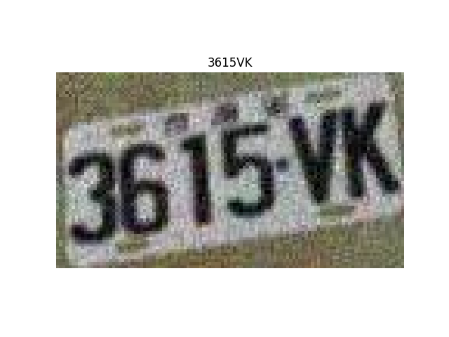
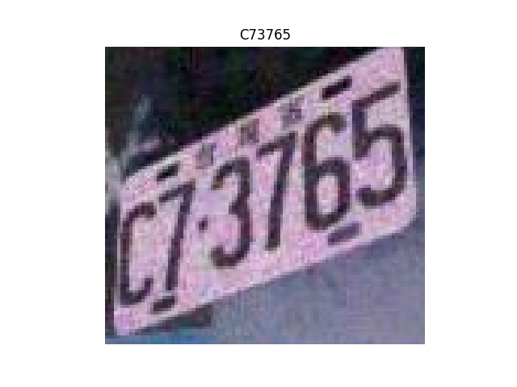
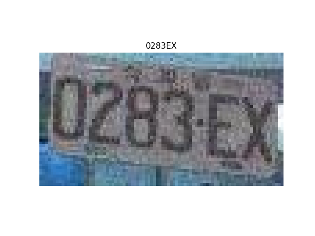
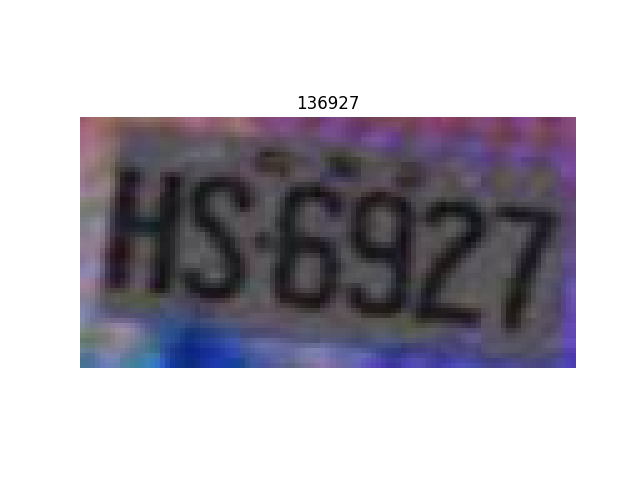
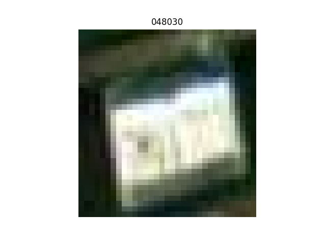
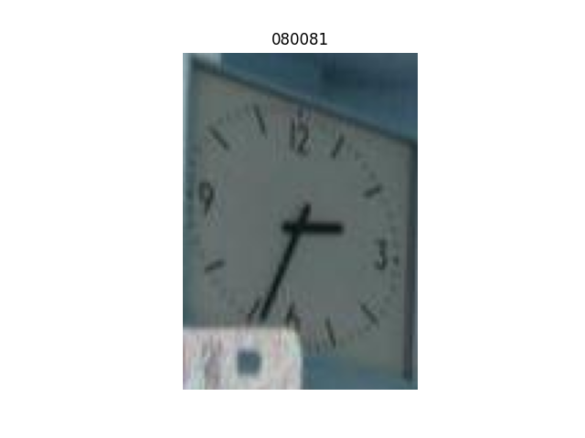

# OCR-Pytorch

## Overview 
This is an educational repository for Optical Character Recognition with light-weight CNN-LSTM model. The input is assumed to be cropped license plates sourced from object-detection network outputs. Images are resized to 64 by 128 for standardization. With the current model and without noise removal or preprocessing techniques, it achieves a 0.24 CTC Loss and 0.53 Levenshtein average distance. 

## Results
Majority of predicted text are successfull in completely predicting the characters of the given image. However, when predictions fail, predicted texts are fairly close and would likely be more robust with image denoising as preprocessing. Some images were also incorrectly cropped or too low in resolution and influenced testing results unfairly.

<table>
  <tr>
    <td></td>
    <td></td>
    <td></td>
  </tr>
  <tr>
    <td></td>
    <td></td>
    <td></td>
  </tr>
</table>

## Table of Contents
- [Results](#results)
- [Installation](#installation)
- [Dataset](#dataset)
- [Usage](#usage)
  - [Inference](#inference)
  - [Training](#training)

## Installation

1. Clone the repository:
    ```bash
    git clone https://github.com/CodeKnight314/OCR-Pytorch.git
    ```

2. Create and activate a virtual environment (optional but recommended):
    ```bash
    python -m venv ocr-env
    source ocr-env/bin/activate
    ```

3. cd to project directory: 
    ```bash 
    cd OCR-pytorch/
    ```

4. Install the required packages:
    ```bash
    pip install -r requirements.txt
    ```
## Dataset
Dataset was sourced from kaggle public datasets and organized through `split-folders` library into train, val, and test subdirectories. Dataset is available via the public [google drive link](https://drive.google.com/file/d/1svARnKkNUNA-KUYf6AqdnxOqW4B8JPRK/view?usp=sharing) shown here. 

## Usage

### Inference

Use the `inference.py` script to perform OCR on images in a specified directory.

**Arguments:**
- `--dir`: Path to image directory containing images
- `--weight`: Path to model weights
- `--output`: Path to saving inference results
- `--json`: Path to char-idx.json

**Example:**
```bash
python inference.py --dir ./data/input --weight ./model/weights --output_dir ./data/output --json ./dict/json
```

### Training
Use the `train.py` script to train the OCR model. Example of usage shows all necessary argumenets for running `train.py`

**Arguments:**
- `--root` Root directory for the dataset
- `--csv` Path to the CSV file containing labels
- `--lr`: Learning rate
- `--epochs`: Number of epochs
- `--batch_size`: Batch size
- `--save_dir`: Directory to save model checkpoints.

**Example:**
```bash
python train.py --root ./data/input --csv ./data/csv
```
